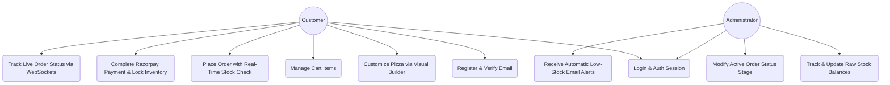
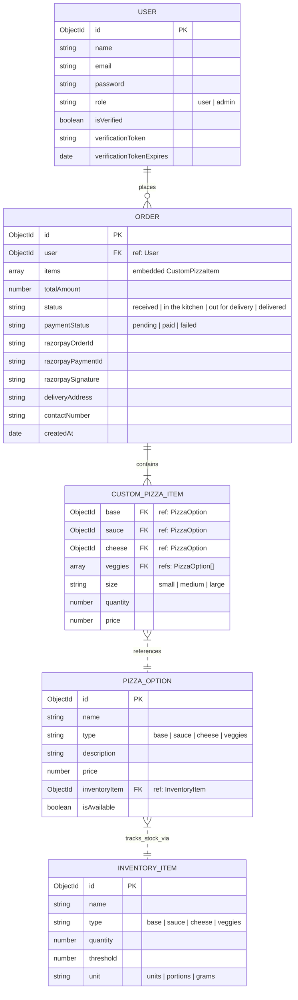

# CrustCraft - System Diagrams

This document contains the visual systems diagrams for the CrustCraft pizza customization and inventory-locking platform. You can render these diagrams directly in any markdown viewer supporting Mermaid.js (e.g., GitHub, VS Code preview).

---

## 1. Use Case Diagram

The use case diagram illustrates how customers and system administrators interact with the CrustCraft platform features.

---

## 2. Entity-Relationship (ER) Diagram

The ER diagram defines the database schema structure, collections, attributes, and relationships managed inside MongoDB by Mongoose models.

